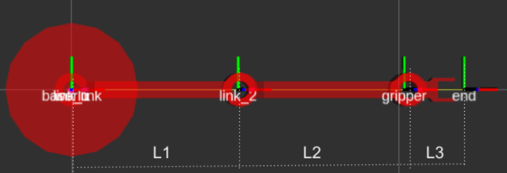

# Planar 3DOF manipulator robot

This project implements a 3D planar robot in urdf. It also contain a launch with a *robot_state_publisher* and a *joint_state_publisher_gui*

This urdf create a planar robot with the next chain:
```
robot name is: planar_3dof
---------- Successfully Parsed XML ---------------
root Link: world has 1 child(ren)
    child(1):  base_link
        child(1):  link_1
            child(1):  link_2
                child(1):  gripper
                    child(1):  end

```


This is an adaptation of an old example of ros industrial tutorial(before [docs](https://industrial-training-master.readthedocs.io/) ) about how to create and urdf files



where, $l_1=l_2=0.5$ y $l_3=0.18$ 

**TODO: put the instruction about how to create the urdf**
The full name of URDF (United Robotics Description Format) is a language format used to describe robots in the XML grammar framework. URDF is very popular in ROS world. We can model the robot through URDF and put it in ROS for simulation and analysis.

The robot should be described through a tags, where the ***link*** represent the geometry of the robot and the ***joint*** represent the articulation or degree of fredoom of the robot. The tags are documented in [wiki ros](http://wiki.ros.org/urdf/XML), where can be find other tags like sensor or transmission  which let to describe this part of robot.

Steps to reproduce this repository:

- [create a package](https://docs.ros.org/en/foxy/Tutorials/Creating-Your-First-ROS2-Package.html):
```
    cd ~/utadeo_ws/src
    ros2 pkg create --build-type ament_python lesson_urdf
```
- Edit the files package.xml to add the next dependencies and your information about the package
```      
      <depend>urdf</depend>
      <build_depend>launch_ros</build_depend>
      <exec_depend>launch_ros</exec_depend>
      <exec_depend>robot_state_publisher</exec_depend>
      <exec_depend>joint_state_publisher_gui</exec_depend>
``` 
- make a folder urdf inside ~/utadeo_ws/src/lesson_urdf
```
    cd ~/utadeo_ws/src/lesson_urdf
    mkdir urdf
    gedit planar_3dof.urdf
```
- Create the tag robot inside the file
```      
    <?xml version="1.0"?>
    <robot name="planar_3dof" xmlns:xacro="http://ros.org/wiki/xacro">
    </robot>
 ```
- create a link without geometry which is the world (inside tag ***robot***)
 ```
 <link name="world" />
 ```
- create a link **base_link** which describe the base of the robot of the figure. Note that this link has a ***visual*** tag which describe the ***geometry*** an ***material*** of the piece. It also contain another geometry which is the ***collision*** geometry which could describe a simplified geometry to check collision or other tasks. In this case we represent the base of the robot with a ***cylinder*** of length 0.1 and width 0.2. The cilynde ris created 
```  
  <link name="base_link">
    <visual>
      <origin rpy="0 0 0" xyz="0 0 0" />
      <geometry>
        <cylinder length="0.1" radius="0.2" />
      </geometry>
      <material name="Cyan">
        <color rgba="0 1.0 1.0 1.0"/>
      </material>
    </visual>
  <collision>
    <origin rpy="0 0 0" xyz="0 0 0" />
    <geometry>
      <cylinder length="0.1" radius="0.2" />
    </geometry>
    <material name="grey"/>
  </collision>
    
  </link>
```
-  create a ***joint*** fixed to the world
```
<joint name="fixed" type="fixed">
    <parent link="world" />
    <child link="base_link" />
  </joint>
```  
 - now create the ***link*** link_1, but now the geometry will be an stl file inside the folder meshes of our project (lesson_urdf). Note that we also can add ***inertial*** propierties of the robot like center of mass and inertia matrix of each link. Also note that collision and visual geometry could be diferrent. Here the cylinder made to simplify the link has a length 0.5 and radius 0.05, but this geometry is created over z axis since -0.25, so in ***origin*** we rotate the figure in y 90 degrees(1.5708) and translate in x 0.25 to start in zero. 
```
    <link name="link_1">
    <visual>
      <geometry>
        <mesh filename="package://lesson_urdf/meshes/visual/arm_link.stl" scale="1 1 1" />
      </geometry>
      <material name="red"/>
    </visual>
    <collision>
      <origin rpy="0 1.5708 0" xyz="0.25 0 0" />
      <geometry>
        <cylinder length="0.5" radius="0.05" />
      </geometry>
      <material name="red"/>
    </collision>
    <inertial>
      <origin xyz="0 0 .25" rpy="0 0 0" />
      <mass value="1" />
      <inertia ixx="1.0" ixy="0.0" ixz="0.0" iyy="1.0" iyz="0.0" izz="1.0" />
    </inertial>
  </link>
 ```
- now we create the ***joint*** with ***parent*** the base_link and ***child*** the link_1 of type *revolute*. Note that here the ***axis*** of rotation  is over z and the link_1 is translated 0.05 over z from the origin of the base_link.
```
  <joint name="joint_1" type="revolute">
    <parent link="base_link" />
    <child link="link_1" />
    <origin xyz="0 0 0.05" rpy="0 0 0" />
    <axis xyz="0 0 1" />
    <limit lower="-1.57" upper="1.57" effort="0" velocity="0.5" />
  </joint>
```
- Repetae the process for *link_2*, *gripper* and a link without geomtery *end* 
...

- save the file
- now copy the meshes,rviz and launch folder (TODO [tutorial about launch](https://docs.ros.org/en/foxy/Tutorials/Launch-system.html))
- configure in setup.py the files to be copy:
     - Add the library at the beginning of the file
        ```
        from glob import glob
        ```  
     - append these  lines inside data_files
        ```
            ('share/' + package_name, glob('launch/*.py')),
  	        ('share/' + package_name+'/urdf/', glob('urdf/*')),
            ('share/' + package_name+'/rviz/', glob('rviz/*')),
  	        ('share/' + package_name+'/meshes/collision/', glob('meshes/collision/*')),
  	        ('share/' + package_name+'/meshes/visual/', glob('meshes/visual/*')),
        ```
- compile the workspace
```
    cd ~/utadeo_ws
    colcon build
```
- add to path the workspace
```
    . install/setup.bash
```
- run the launch file
```
    ros2 launch lesson_urdf view_robot_launch.py
```


Some error could be:
To execute this package please add this to the .bashrc or to the specific console ([Show basic URDF model in Rviz2](https://answers.ros.org/question/348984/show-basic-urdf-model-in-rviz2/) )

echo "export LC_NUMERIC="en_US.UTF-8"" >> ~/.bashrc


